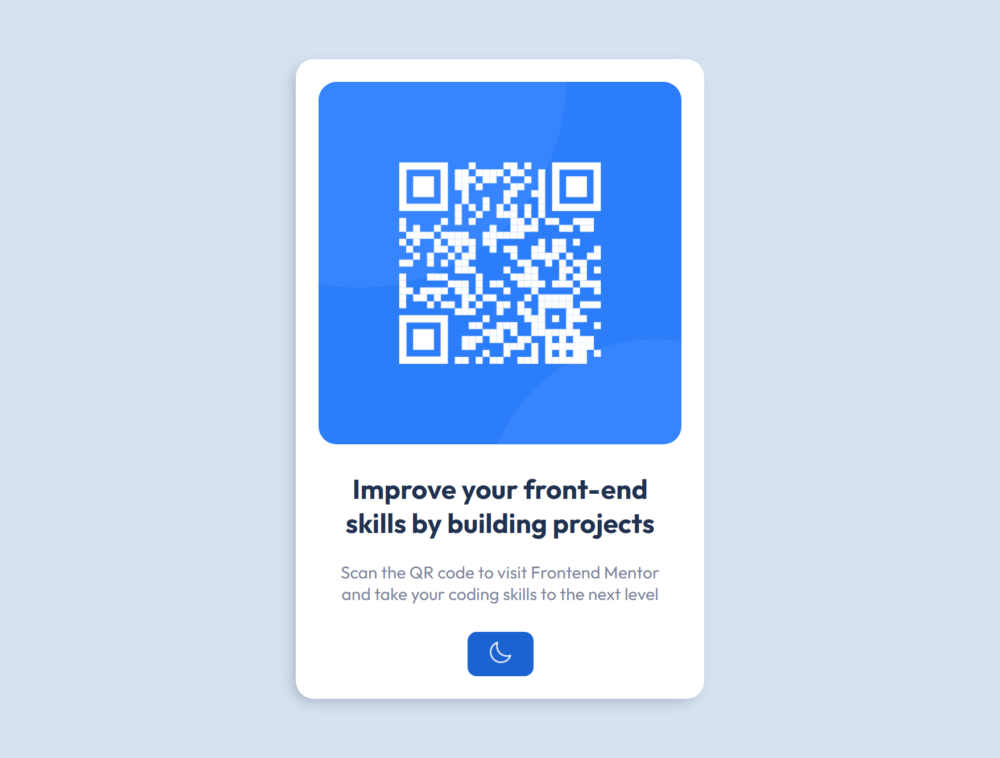
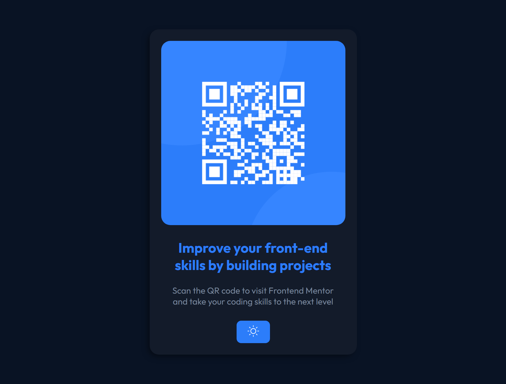

<h1 align="center"> Frontend Mentor - QR code component solution </h1>

This is a solution to the [QR code component challenge on Frontend Mentor](https://www.frontendmentor.io/challenges/qr-code-component-iux_sIO_H). Frontend Mentor challenges help you improve your coding skills by building realistic projects.

 

  <a href="#-tecnologias">Tecnologias</a>&nbsp;&nbsp;&nbsp;|&nbsp;&nbsp;&nbsp;
  <a href="#-projeto">Projeto</a>&nbsp;&nbsp;&nbsp;|&nbsp;&nbsp;&nbsp;
  <a href="#-screenshots">Screenshots</a>&nbsp;&nbsp;&nbsp;|&nbsp;&nbsp;&nbsp;
  <a href="#-links">Links</a>&nbsp;&nbsp;&nbsp;

 

## 🚀 Tecnologias

Esse projeto foi desenvolvido com as seguintes tecnologias:

- HTML e CSS
- JavaScript

## 💻 Projeto

O desafio era construir esse card de QR e fazê-lo parecer o mais próximo possível do design original.
   
Além de cumprir o desafio, implementei a opção de mudar o esquema de cores do layout, podendo escolher entre "Dark theme" ou "Light theme". A mudança do tema ocorre automaticamente de acordo com o tema definido  nas preferências do usuário, utilizando o "prefers-color-scheme", fora isso, utilizei também o "localStorage" para guardar o último tema escolhido, para quando o usuário voltar a acessar a página seu tema estará lá..

## 📸 Screenshots

  
  

## 🌎 Links

- Solution: [https://www.frontendmentor.io/solutions/qr-code-component-html-css-js-dark-and-light-theme-Nn0ju7_skn](https://www.frontendmentor.io/solutions/qr-code-component-html-css-js-dark-and-light-theme-Nn0ju7_skn)
- Live Site: [https://qr-code-component-aandreluis.netlify.app/](https://qr-code-component-aandreluis.netlify.app/)

---
